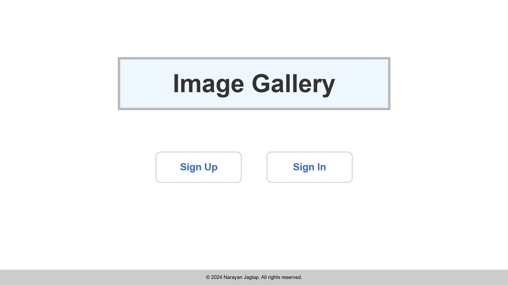
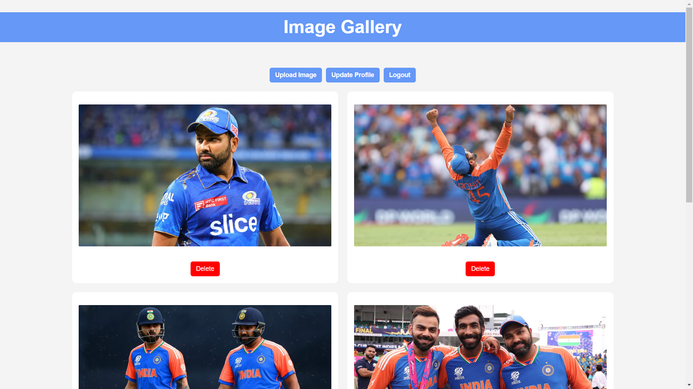

# 📷 Image Gallery Project

## 🚀 Overview
The **Image Gallery Project** is a web-based application that allows users to **upload, view, and manage** images securely. Built using **Java, JSP, Servlets, JDBC and MySQL**, it provides features like **user authentication, image pagination, and profile management**. Additionally, users can **register for an account, log in securely, and manage their credentials** to ensure a personalized experience.
## 🎯 Features
✅ **User Authentication** - Secure login and registration using MySQL.  
✅ **Image Upload & Storage** - Users can upload images with descriptions.  
✅ **Image Display with Pagination** - View images with proper pagination.  
✅ **Delete Images** - Users can remove their uploaded images.  
✅ **Profile Management** - Update username and password.  
✅ **Session Management** - Secure user sessions for authentication.  

## 🏗️ Tech Stack
- **Frontend:** HTML, CSS, JSP
- **Backend:** Java, Servlets, JDBC
- **Database:** MySQL
- **Server:** Apache Tomcat

## 📂 Project Structure
```
ImageGalleryProject
│
├── src
│   └── com.example
│       ├── dao
│       │   ├── ImageDAO.java
│       │   └── UserDAO.java
│       ├── model
│       │   ├── Image.java
│       │   └── User.java
│       ├── servlet
│       │   ├── ImageUploadServlet.java
│       │   ├── ImageDisplayServlet.java
│       │   ├── DeleteImageServlet.java
│       │   ├── LoginServlet.java
│       │   ├── RegisterServlet.java
│       │   ├── LogoutServlet.java
│       │   └── UpdateProfileServlet.java
│
├── WebContent
│   ├── index.html
│   ├── login.jsp
│   ├── register.jsp
│   ├── upload.jsp
│   ├── gallery.jsp
│   ├── updateProfile.jsp
│   ├── css
│   │   └── styles.css
│   └── WEB-INF
│       └── web.xml
│
└── lib
    └── mysql-connector-java-x.x.x.jar
```

## 🎲 Database Setup
Run the following SQL queries to create the database and tables:
```sql
CREATE DATABASE image_gallery;
USE image_gallery;

CREATE TABLE users (
    id INT AUTO_INCREMENT PRIMARY KEY,
    username VARCHAR(50) NOT NULL UNIQUE,
    password VARCHAR(255) NOT NULL
);

CREATE TABLE images (
    id INT AUTO_INCREMENT PRIMARY KEY,
    name VARCHAR(255) NOT NULL,
    description TEXT,
    file_path VARCHAR(255) NOT NULL,
    uploaded_at TIMESTAMP DEFAULT CURRENT_TIMESTAMP
);
```

## 📸 Screenshots
| Home Page | Add Note | Show Notes | Edit Note |
|-----------|---------|------------|-----------|
|  |  |  |  |


## 📸 Screenshots
| Home Page | Reg Page | Login Page | view Gallery |
|-----------|---------|------------|-----------|
|  |  |  |  |

| view Gallery | Update Profile | Gallery Page | Upload Image |
|------------|-------------|-------------|-------------|
|  |  |  |  |

## 👨‍💻 Contributing
Feel free to **fork** this repository, create a new branch, and submit a PR. Contributions are always welcome!  

## 💬 Contact
For any queries or suggestions, reach out to:
- 📧 Email: sj967334@gmail.com
- 💼 Portfolio: [Narayana](https://narayanjagtap.github.io/NarayanaPortfolio/)
- 🔗  Linkedin: [narayanpjagtap](https://www.linkedin.com/in/narayanpjagtap/)
